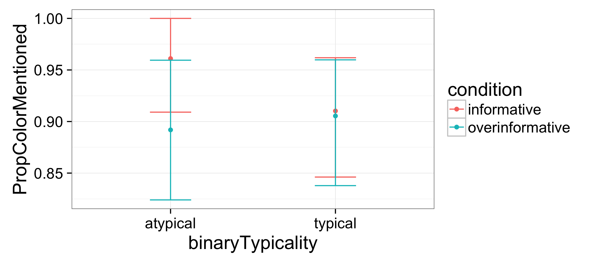
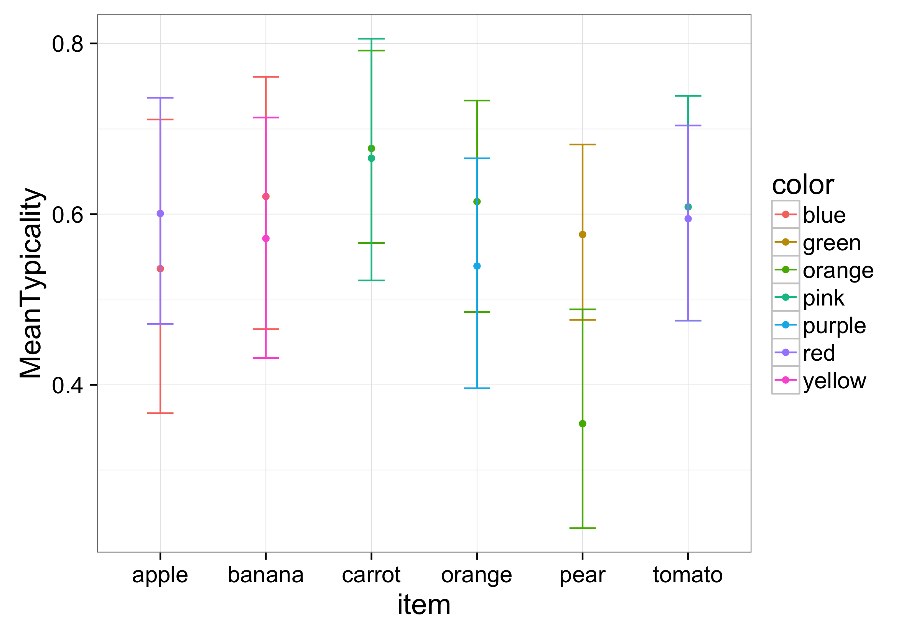

09/23/2016
## Idea

- What we want to find out: Are the typicality values fix in our semantic knowledge, or are they constantly updated by our world knowledge? Therefore, does an exposure of a new frequency of an object’s color influence how we produce overinformative expressions?
- If typicality values are taken from world knowledge, we have 0 and 1 valued semantics that are then multiplied with knowledge from the real world. If the typicality is in the semantics, we already have truth conditional values between 0 and 1. (Important when thinking about how to construct the model.)

## Experimental set-up

- Story
    - Daxi (Alien): Can you help me sort my food?
- 6 different items each in 2 colors, 2 (maybe 3) conditions
    - Item (typical color, atypical color): banana (yellow, blue), apple (red, blue), pear (orange, green), carrot (orange, pink), tomato (red, pink), orange (orange, green) [update 10/07/2016]
    - 3 prevalence/frequency conditions: low - atypical color no (in current study [update 10/07/2016])/ only in very few instances, middle - atypical color in 50% of the instances, high - atypical color in (almost) every instance
    -—>  6 different combinations per item

## Exposure

- Sorting: sort food in labeled bins
- Maybe always have sweets as the last thing to be sorted into buckets because looking at them closely is not so important

Question: Make typicality measure and production on one subject or separately? If together, which one first?

_________________
09/30/2016
6 items in 2 - 3 colors

## Production

- 4 targets for each item (typical color overinformatively, atypical color overinformatively, typical color only informatively, atypical color only informatively) —> 24 targets in total
- Either free production or showing alternative answers and most fitting needs to be chosen

## Distribution/ Typicality measurement

- Ideas:
    - Normal typicality measurement (as seen before; chosen in current study [update 10/07/2016])
    - Show (or just sketch (no shades)) b/w food item and ask which color this most probably has
    - Show (or just sketch (no shades)) b/w food item and have a slider that goes from yellow to blue banana: where to position the slider between the two according two likelihood of the color

_________________
10/05/2016
## Thoughts on contexts

- In current study: Instead of making targets such as
    - Banana yellow (target), x, y
    - Banana yellow (target), banana blue, y
    - Banana blue (target), x, y
    - Banana blue (target), banana yellow, y
—> Have color being informatively/overinformatively
- One could also do
    - Banana yellow (target), x, y
    - Banana yellow (target), something else being yellow, y
    - Banana blue (target), x, y
    - Banana blue (target), something else being blue, y
—> Have color being useful/useless

_________________
10/12/2016
## Exp 11

- Included blocks: Typicality (How typical is this color for this object?)
- Results:
    - Typicality:
        - 
- Problems:

## Exp 10

- Included blocks: Exposure, Production, Typicality (How typical is this color for this object on Daxy's planet)
- Results:
    - Production:
        - distribution_effect_production
    - Typicality:
        - 
        - 
- Problems:

## Exp 12

- Included blocks: Production, Typicality (How typical is this color for this object (for you)?)
- Results:
    - Production:
        - 
    - Typicality:
        - 
- Problems:

## Exp 14

- Included blocks: Production, Typicality (How typical is this color for this object on Daxy's planet)
- Results:
    - Production:
        - 
    - Typicality:
        - 
- Problems:
    - People were unsure whether Daxy knew the words for fruit items
    --> they used color adjectives a lot to avoid naming the fruit 
    --> overinformativeness values are "useless"

## Exp 15

- Included blocks: Production, Typicality (How typical is this color for this object on Daxy's planet)
- Comments: 
    - Difference to 14: Tell participants explicitely that Daxy understands fruit types
- No results yet

