09/23/2016  
most recent update: 10/13/2016
## Idea

- What we want to find out: Are the typicality values fix in our semantic knowledge, or are they constantly updated by our world knowledge? Therefore, does an exposure of a new frequency of an object’s color influence how we produce overinformative expressions?
- If typicality values are taken from world knowledge, we have 0 and 1 valued semantics that are then multiplied with knowledge from the real world. If the typicality is in the semantics, we already have truth conditional values between 0 and 1. (Important when thinking about how to construct the model.)

## General experimental set-up

- Story
	- Foreign planet --> to explain existence of weirdly colored food
	- Daxy (alien), or other human being as imaginary conversation partner 
- 3 main blocks: Exposure, Production, Typicality
- 6 different items each in 2 colors
    - Item (typical color, atypical color): banana (yellow, blue), apple (red, blue), pear (orange, green), carrot (orange, pink), tomato (red, pink), orange (orange, green) (for Exp 10,12,14,15); replacement of orange by pepper (Exp 16)
    
## Exposure

- Sorting: Sort food into labeled bins
- 3 prevalence/frequency conditions: low - atypical color in no instances, middle - atypical color in 50% of the instances, high - atypical color in every instance  
    -—> 6 different combinations per item (combining color and conditions, 2x3)  
    --> Conditioning doesn't take place if there is no exposure

## Production

- 4 targets for each item (typical color overinformatively, atypical color overinformatively, typical color only informatively, atypical color only informatively) —> 24 targets in total
	- Banana yellow (target), x, y
	- Banana yellow (target), banana blue, y
	- Banana blue (target), x, y
	- Banana blue (target), banana yellow, y  
	—> Have color being informatively/overinformatively 
- Free production

## Distribution/ Typicality measurement

- Normal typicality measurement (as seen before)

## Ideas for variations

- Take 3 instead of 2 colors
- ~~Maybe always have sweets as the last thing to be sorted into buckets because looking at them closely is not so important~~
- Take novel objects instead of already known fruits/ vegetables
- Interchange order of production and typicality to get purer results in typicality/ distribution measurements
- Include distribution summary slide after exposure
- Production:
	- Context variation: 
		- Another approach to the four different cases
		    - Banana yellow (target), x, y
		    - Banana yellow (target), something else being yellow, y
		    - Banana blue (target), x, y
		    - Banana blue (target), something else being blue, y  
			—> Have color being useful/useless
		- Have more distractors (Westerbeek had 6 items in context)
	-  Show alternative answers, most fitting needs to be chosen 
-  Typicality:
	- Show (or just sketch (no shades)) b/w food item and ask which color this most probably has
	- Show (or just sketch (no shades)) b/w food item and have a slider that goes from yellow to blue banana: where to position the slider between the two according two likelihood of the color
	- Alternatively the versions above can be done with asking for the color of the specific item, as black and white may already influence the probability of the color (yellow being very bright, blue being rather dark)

## Overinformative values
- Westerbeek: 
	- Typical color mean: 15%
	- Atypical color mean: 75%
- Mitchell:
	- Typical material mean: 36 out of?
	- Atypical material mean: 41
	- Typical shape mean: 29
	- Atypical shape mean: 54
- Rubio-Fernandez:
	- Exp1 (English speakers): Mean proportion of redundant color adjectives: 95% (polychrome) to 37% (monochrome)
	- Exp2 (Spanish speakers):
		- Typical: 0%
		- Atypical: 14% to 67% (depending on type of instructions)
_________________

## Experimental overview

without orange (with orange)

|Exp|Inform. atyp. |Inform. typ.  |Overinf. atyp.|Overinf. typ. |Changes|
|---|--------------|--------------|--------------|--------------|----------|
|12 |74% (76%)     |80% (85%)     |73% (65%)     |56% (58%)     |no exposure|
|14 |94% (91%)     |79% (85%)     |63% (64%)     |62% (73%)     |no relevant change|
|15 |100% (100%)   |83% (86%)     |63% (68%)     |45% (47%)     |clarification that Daxy understands fruit names; orange is replaced by pepper|
|16 |87%           |80%           |48%           |41%           |change listener from Daxy to human being|
|17 |NA            |NA            |51%           |40%           |back with Daxy; no informative trials|
|18 |NA            |NA            |54%           |46%           |include color competitor (still no informative trials)|
|19 |NA            |NA            |39%           |32%           |include greebles (still color competitor and no informative trials)|

_________________
## Exp 11

- Included blocks: Typicality (How typical is this color for this object? - no alien reference at all)
- Participants: 30?
- Aim: 
    - Find a general typicality norm for chosen items (with usual world knowlwedge and no mention of an artificial world)
- Results:
    - Typicality:     
        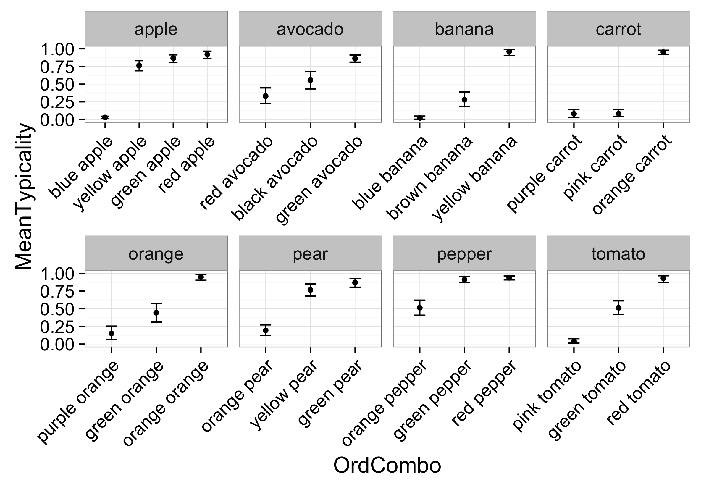
        - Items with biggest typicality difference: apple (blue, red), banana (blue, yellow), carrot (purple, orange), tomato (pink, red)
        - Items with good mid-typicality values: pepper (orange, red), orange (green, orange), avocado (black, green), tomato (green, red)
        - Red avocado wasn't as atypically perceived as expected; Brown banana was more atypical than expected; Pink and purple carrot are very atypical even though they exist
- Problems:
    - Unclear whether orange was always perceived as an orange (could be lime, plum)

## Exp 10

- Included blocks: Exposure, Production, Typicality (How typical is this color for this object on Daxy's planet) 
- Participants: 15
- Aim:
    - Show possible problems with the set-up
    - Compare typicality values to former study: Do people adapt? Do they disregard their normal world knowledge completely when evaluating Daxy's planet?
    - Can a certain exposure of an object in a certain color influence the speech production in a reference game? (might an alien "listening" make a difference to a human being listening?)
- Results:
    - Production:     
        with orange 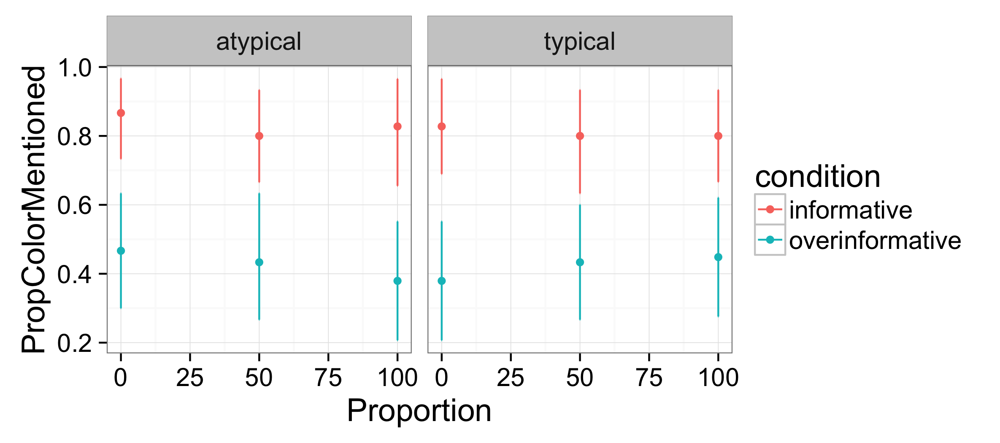  
        without orange   
        - If the color is needed for an unambiguous reference (informative (red) condition), the use of color adjectives stays approximately stable along different exposure phases, i.e., the color is mentioned
        - If the atypical color is not needed to name for an unambiguous reference (overinformative (blue) condition), the use of the color adjective decreases slightly with increased exposure --> we can make the atypical color more typical (used less overinformatively) --> great!
        - If the typical color is not needed to name for an unambiguous reference (overinformative (blue) condition), the use of the color adjective increases slightly with increased exposure --> weird!?
    - Typicality:     
        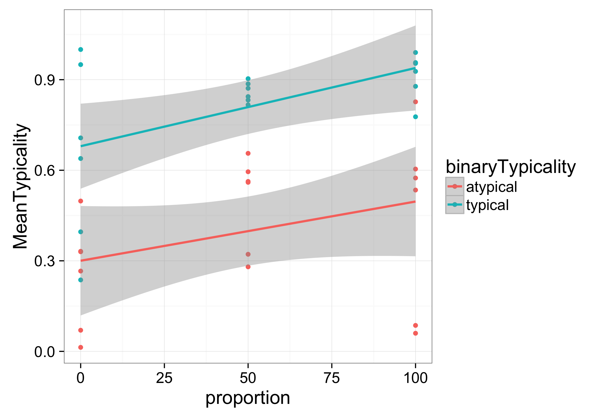
        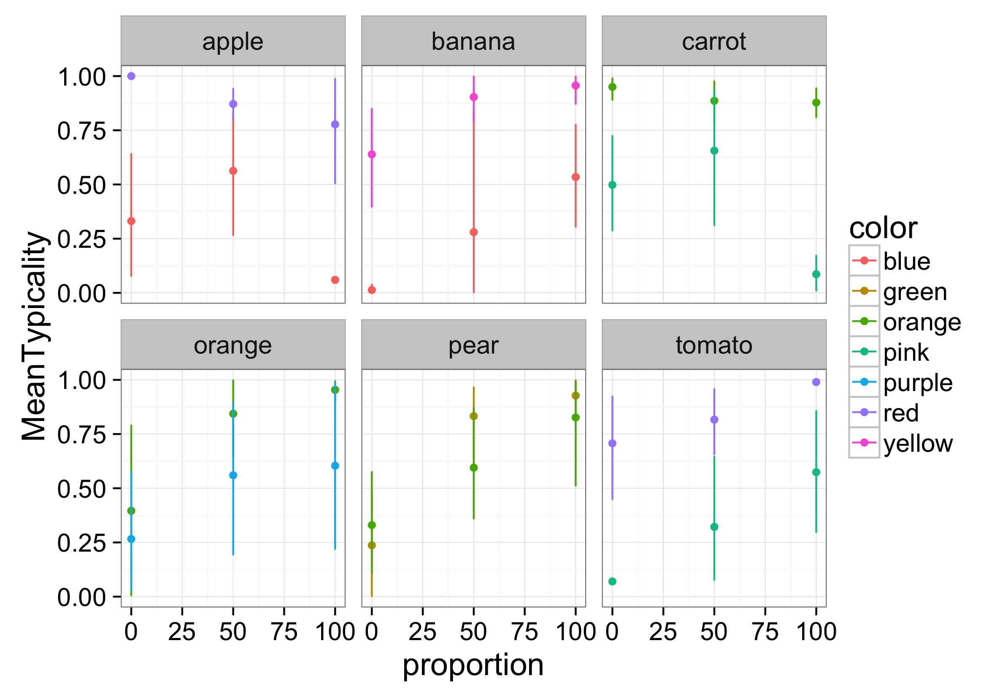
        - The rated typicality shows the expected upward shift (typicality increases with increased exposure) 
        - Comparing atypical color with typical color with same exposure: Participants constantly rate normally typical color higher than normally atypical color, even though when we just look at the evidence from Daxy's planet, they should be the same --> special case: pear
        - In former study, pear was item with most acceptable color in atypical case; it is the only one here, where in one condition (no instance of (a)typical color was shown in exposure), the atypical color was rated approximately with the same typicality as the typical one (and even higher)
- Problems:
    - Production: Typical color in different exposures behaves weirdly. If participant wasn't exposed to typical color, he used it less overinformatively than when exposed to it a lot.
    - Typicality: Apple behaves weird, which can be connected to fact, that sometimes there is only just one data point for a certain value --> general problem: amount of data

## Exp 12

- Included blocks: Production, Typicality (How typical is this color for this object (for you)?)
- Participants: 15
- Aim:
    - Trying to get a baseline, what people do, when not actively exposed with fruit items in different colors
    - Does the typicality measure differ from the one in Exp 11 (original norming study)
- Results:
    - Production:     
        
        - Atypical colors are mentioned more often than typical colors (what other studies also have shown), but we have a very high rate; possible reason: people didn't know that Daxy understands fruit names and therefore tried to avoid them 
    - Typicality:     
        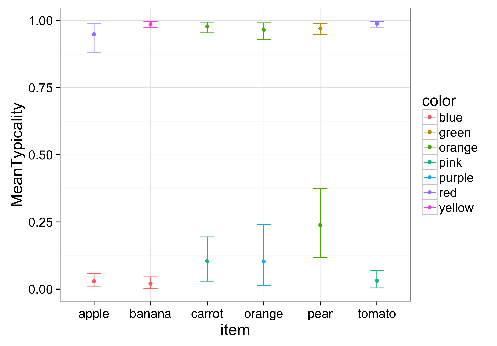
        - Almost exact replica of original color norming data (Exp 11)
- Problems:
	- People were unsure whether Daxy knew the words for fruit items
    - --> they used color adjectives a lot to avoid naming the fruit 
    - --> overinformativeness values are "useless"

## Exp 14

- Included blocks: Production, Typicality (How typical is this color for this object on Daxy's planet)
- Participants: 15
- Aim:
	- How does the typicality measurement change, when not asking "for you", but "on Daxy's planet"  
- Results:
    - Production:     
        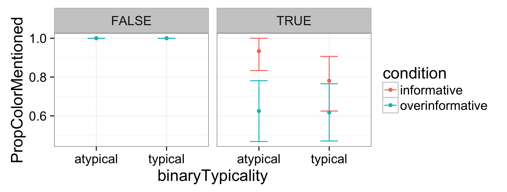
        - Same problem as in Exp 12
    - Typicality:     
        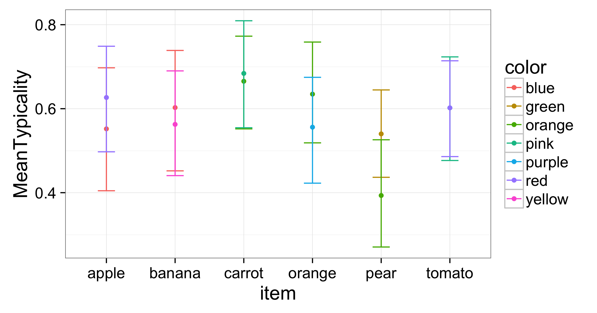
        - Even though there was no exposure, participants noticed that for the meal preparation, there were as much atypically colored fruits as typically colored fruits; this can be seen in the rating as atypically and typically colored fruits are rated equally being at ca 6 in the typicality measurement
- Problems:
    - People were unsure whether Daxy knew the words for fruit items
    - --> they used color adjectives a lot to avoid naming the fruit 
    - --> overinformativeness values are "useless"

## Exp 15

- Included blocks: Production, Typicality (How typical is this color for this object on Daxy's planet)
- Participants: 15
- Aim:
	- With clarified instructions, that Daxy understands fruit names, look at production and usage of overinformative expressions 
- Comments: 
    - Difference to 14: Tell participants explicitely that Daxy understands fruit types
- Results:
	- Production:  
		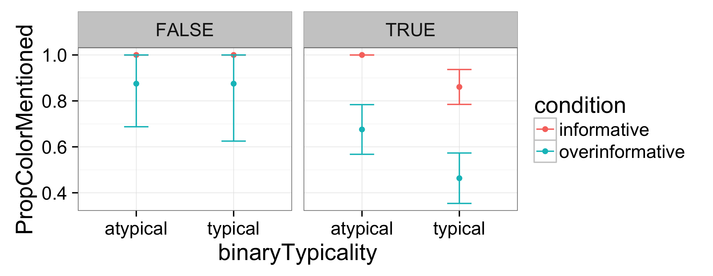
		- Left side: If item wasn't mentioned; Right side: If color was mentioned
		- If the color is typical, it is used a lot less than the atypical color in the overinformative and also in the informative (!!!) condition  
		
		- All items show the wanted effect, although the carrot not as much as the others; the orange can't be evaluated (it seems "orange orange" is problematic)
	- Typicality:  
		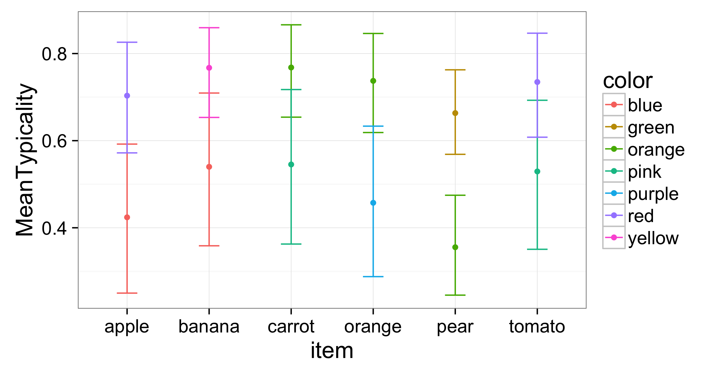
		- Should be the same as in Exp 14, but data points are a bit more apart (along y-axis)
- Problems:
	- Orange can't be properly evaluated because of "orange orange" 
	- Considering the overinformative values in the typical colors, they are a lot higher than in, e.g., the Westerbeek study; possible reasons: insecurity about Daxy's ability of understanding things, or by presenting variously colored fruits, we turn color into a non-reliably (noisy) property, or trials in production prime participants to be more overinformative because they're primed on color being important

## Exp 16

- Included blocks: Production (Typicality would be the same as in Exp 14,15; Orange was from now on replaced by pepper)
- Participants: 15
- Aim:
	- Change listener from Daxy to human being (Dan) to exclude possible overinformativeness effects, i.e., being more overinformative than usual to ensure that Daxy understands
- Results:
	- Production:
	
		- Again we get an effect of people not even being sufficiently informative (if the color is typical they just name the fruit item, even though an atypically colored fruit of the same kind was present) --> don't they accept the other one as being a "real" representative of this kind?
		- The typical overinformativeness rate is still a lot higher than in Westerbeek (2015)
		- Daxy didn't seem to be the reason for people being more overinformative than usual (but there were less cases, where the participants neither mentioned the fruit nor the color)
	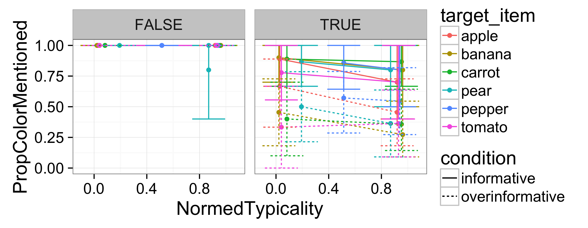
		- Probability of mentioning the color in the pepper case doesn't change as much as more the other, which was expected as it's "atypical" correspondent isn't as much atypical as in the other cases 
- Problems:
	- We still don't know why in the typical overinformative case the probability of mentioning the color is still very high
    
## Exp 17

- Included blocks: Production (Typicality would be the same as in Exp 14,15)
- Participants: 15
- Aim:
	- Leave out the informative trials in production to avoid possible priming of naming the color - Maybe Westerbeek (2015) primed them through is filler trials for not naming the colors?
- Results:
	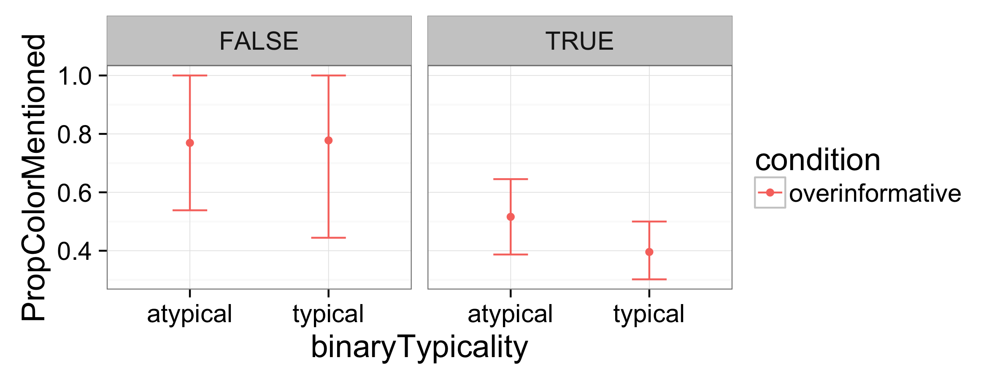
	- Overinformative use of colors still above Westerbeek's; no big change to previous measurements
	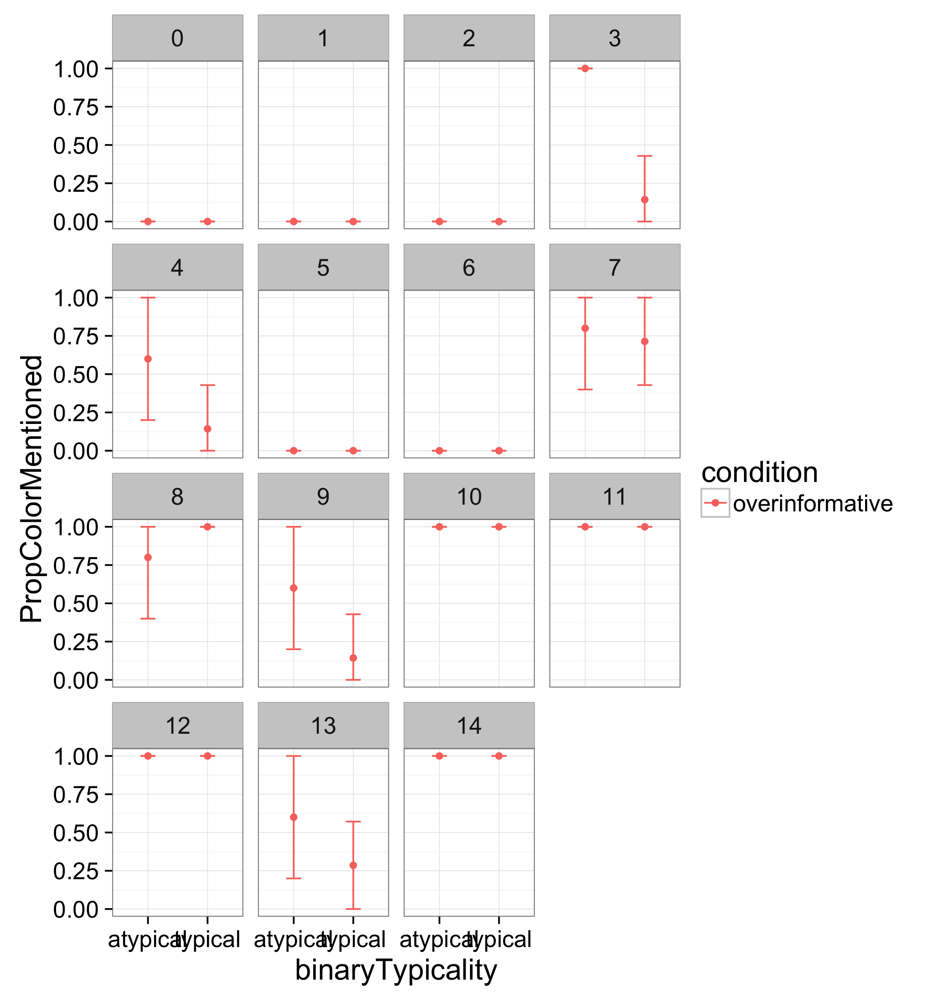
	- Most of the subjects either used color all the time or never
	
	- Effect can be seen in all items, except for pear
- Problems:
	- Still haven't found reason for still high overinformative use of typical color; maybe because Westerbeek always had a distractor in same color as target

## Exp 18

- Included blocks: Production (Typicality would be the same as in Exp 14,15) (include cups, bowls, spoons, yellow/green tomato, orange pepper as distractors)
- Participants: 15
- Aim:
	- Make study more comparable to Westerbeek's by always having one distractor in the same color as target
- Results:
	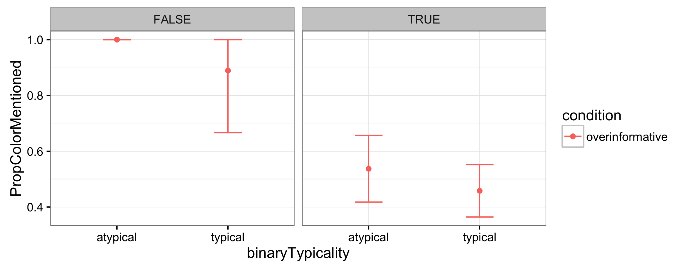
	- Rather smaller typicality effect
	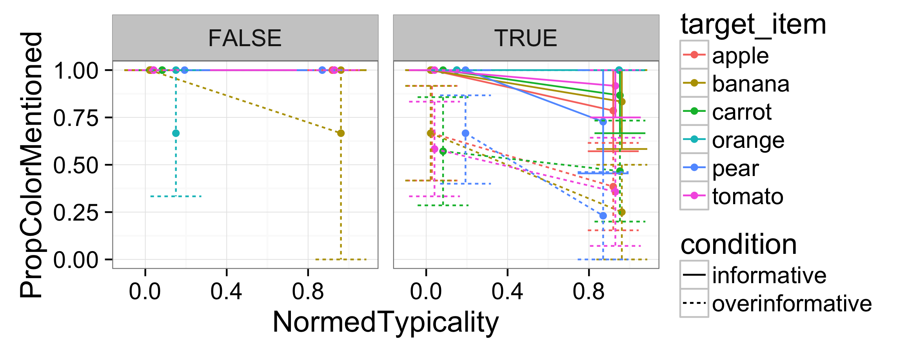
	- Weird behavior: apple, tomato (pepper)
	
## Exp 19

- Included blocks: Production (Typicality would be the same as in Exp 14,15) (only have cups as color competitors)
- Participants: 15
- Aim:
	- Make trials more similar to Westerbeek's study to obtain the same amount of typical overinformative color production, i.e., include greebles (6 trials)
	- Difference to 18: Distractors that have the same color as target are now only cups with a very similar color tone as target 
- Results:
	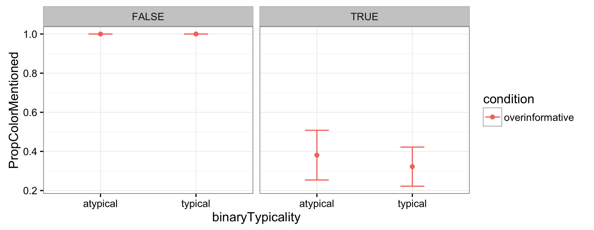
	- Minimal typicality effect with lower values than before
	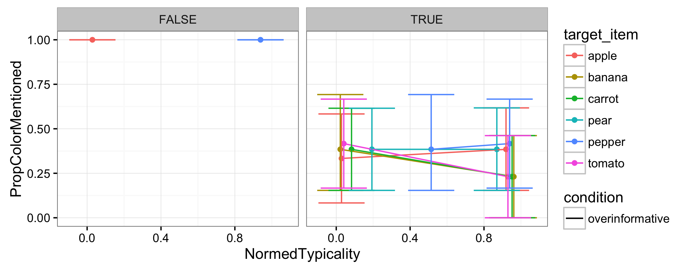
	- Almost no cases, where color was mentioned but not the fruit type 
	- Weird behavior: pear, pepper, apple
- Problems:
	- Also almost no atypical colors were mentioned
	- Almost no typicality effect