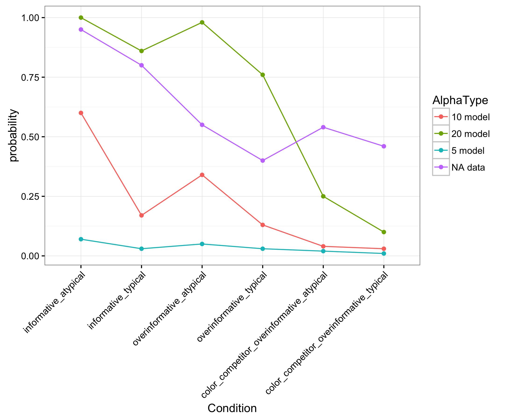
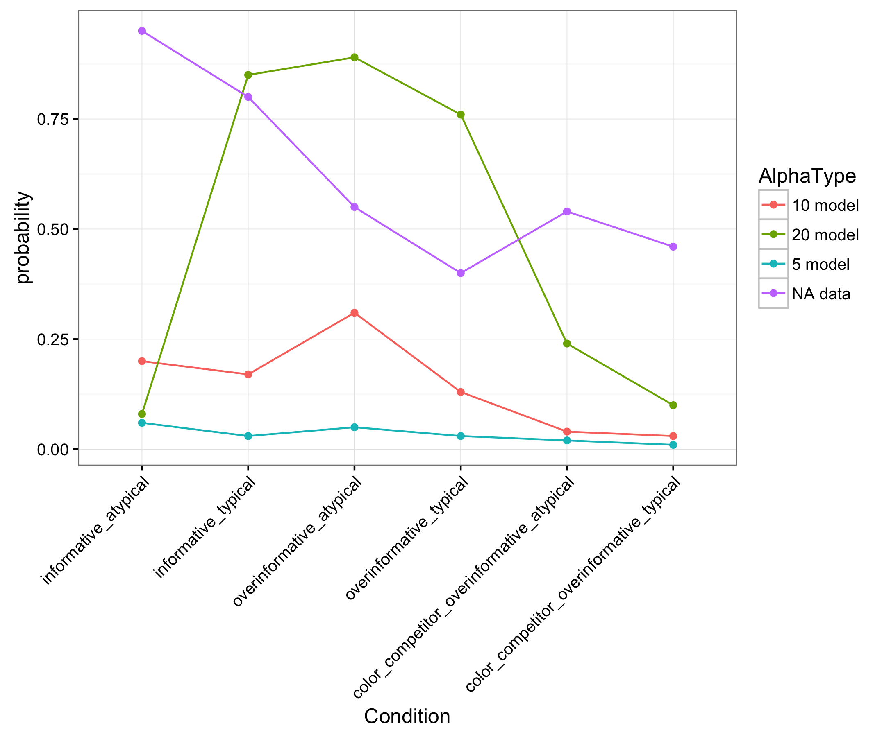

## Compositional semantics approach

- Look-up-table:
	- entry for each item ans color type
	- item entry:
		- how good are the different instances (color+item) for this category
		- e.g.,   
		"banana" : {  
        yellow\_banana : .9,  
        blue\_banana : .3,  
        yellow\_apple : .015,  
        blue\_apple : .015,  
        yellow\_cup : .015,  
        blue\_cup : .015  
        }
	- color entry:
		- how good is this specific color (as seen on the item) as an instance of this color  
		- e.g.,   
		"blue" : {  
        yellow\_banana : .015,  
        blue\_banana : .9,  
        yellow\_apple : .015,  
        blue\_apple : .9,  
        yellow\_cup : .015,  
        blue\_cup : .9  
        }

- Results we want:

|Inform. atyp. |Inform. typ.  |Overinf. atyp.|Overinf. typ. |Color comp. overinf. atyp.|Color comp. overinf. typ.|
|--------------|--------------|--------------|--------------|--------------|--------------|
|90-100%       |80%           |55%           |40%           |54%           |46%           |

- Summary for the typicality connectors:
	- At first, we see both, the typicality and the overinformativeness effect, in almost all of the cases, but in different extents.
Overall, adding up the two typicality values gives the best results at this stage. The values and proportions of the model already give nice results comparing it with the empirical data we have so far. The point where this method is very sensitive to, is the case where a color competitor is added to the overinformative condition (making color mention even more overinformative by adding a distractor with this particular color). So far we haven’t seen a big difference between this and the overinformative context without a color competitor in the data, but the model would definitely predict one.   
This is the aspect where multiplication and taking the mean make predictions that rather correspond (proportionally) to the expected values, but they miss two other things. 1) The difference between the informative condition where a typical color had to be named, and the case where an atypical color had to be named is too big, and 2) the percentages themselves are too small.  
Note that at this point when we include the alternative of only saying the color, this is the preferred choice with all these methods in almost all contexts as it has a low cost and is often very informative. It seems in this case we need a differentiation between modifiers and categories to prevent this (which would also be useful when trying to make the two overinformative contexts more similar to each other).

- Results without possibility of single-color utterances (lengthweight = 5):

Alpha|Cost color|Cost type|Inform. atyp. |Inform. typ.  |Overinf. atyp.|Overinf. typ. |Color comp. overinf. atyp.|Color comp. overinf. typ.|
|----|----------|---------|--------------|--------------|--------------|--------------|----------------|--------------|
|13  |1         |1        |89%           |36%           |66%           |27%           |8%              |4%            |
|13  |.6        |.3       |98%           |80%           |93%           |73%           |38%             |24%           |
|5   |1         |1        |7%            |3%            |5%            |3%            |2%              |1%            |
|20  |1         |1        |99%           |86%           |98%           |76%           |25%             |10%           |

- Cost color = 1, Cost type = 1, lengthweight = 5 without single-color utterances

- Cost color = 1, Cost type = 1, lengthweight = 5 with single-color utterances and only-color utterances have increased costs (w=0, w=1, w=1.5, w=2)  

  

------------------

- Thoughts: 
	- so far we can't include the difference between the category, e.g., banana, and the modifier, e.g., yellow; problem to explain that there isn't a big difference between overinformative with and without color competitor
	- problem: overinf atyp has higher values than inform typ
	- when we include color as single alternative, this outperforms all the other possibilities (not expensive and informative) --> maybe need differentiation between category and modifier (independent of typicality connector)

